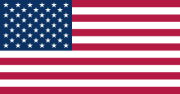

# Tara Sehdave

Hi, my name is Tara Sehdave and I am a senior in highschool. The reason I decided to take AP Computer Science A is because I would like to challenge myself. Although I am not an aspiring software programmer nor an expert in coding, I believe the ability to code is increasingly becoming more relevant and may someday assist me in my future career as a lawyer. 

## Photos with friends and family

      

- I have many friends from all around the country because I have a recurring internship in Georgetown every summer 
- I enjoy joining clubs that allow me to meet people that I would have otherwise not, such as Mock Trial and SACs 
- 

  <svg width="500" height="200">
    <defs>
      <path id="curve" d="M50,150 Q250,50 450,150" fill="transparent" />
    </defs>
    <text width="500" style="font-weight: bold; fill: plum; font-size: 36px;">
      <textPath href="#curve" startOffset="50%" text-anchor="middle">
        Around the World
      </textPath>
    </text>
  </svg>

           

  - I have only been to nine countries but I plan on travelling to many more
      - United States (stationary)
      - Mexico (x6)
      - Canada (x1)
      - Netherlands (x2)
      - Belgium (x1)
      - United Kingdom (x1)
      - France (x2)
      - Italy (x2)
      - India (10+)

  

- My parents are both Indian, but my mom was born and raised in a small Middle Eastern country called Bahrain
- I have a younger brother who is currently a freshman 
- I have two cats— an orange cat who is nineteen years old and a black cat who is three years old 

| Class       | Period 
| ----------- |:-------|
| AP English Literature      |   1      |
| AP Statistics        |   2      |
| AP Computer Science A      |   3      |
| AP United States Government and Politics     |   4      |
| Offroll   |   5      |

    

