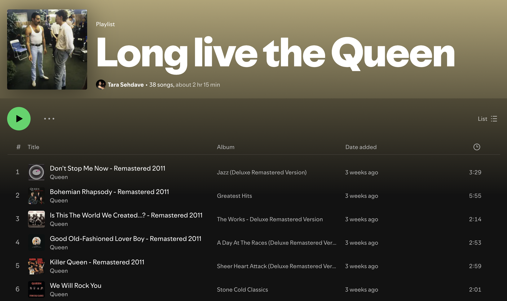
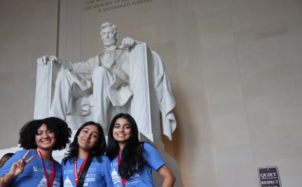
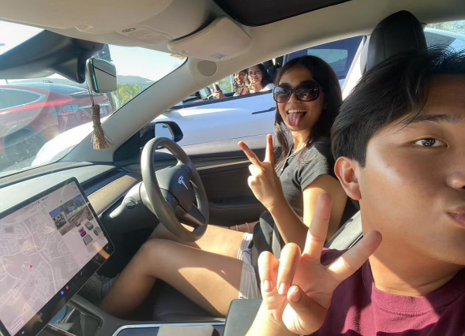

<code style= "color: #f64f2c; font-size:24px"> Tara Sehdave

Hi, my name is Tara Sehdave and I am a senior in highschool. The reason I decided to take AP Computer Science A is because I would like to challenge myself. Although I am not an aspiring software programmer nor an expert in coding, I believe the ability to code is increasingly becoming more relevant and may someday assist me in my future career as a lawyer. 

<code style= "color: #f95b39; font-size:20px"> Favorite Band

<code style= "color: #f95b39; font-size:20px"> Photos with my friends and family 

| Class       | Period 
| ----------- |:-------|
| AP English Literature      |   1      |
| AP Statistics        |   2      |
| AP Computer Science A      |   3      |
| AP United States Government and Politics     |   4      |
| Offroll   |   5      |
